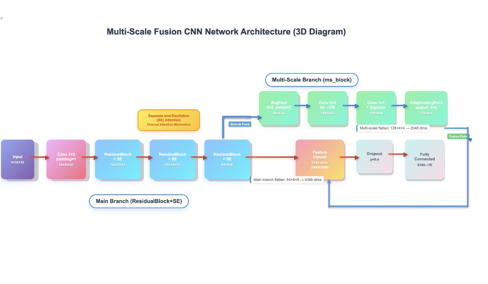

# CIFAR10-ResNet-Attention-Multi-Scale-Fusion
## Preface
This project adopts a network based on residual blccks, attention mechanisms, and multi-scale fusion, challenging to achieve a native test set accuracy of 80% on the CIFAR10 dataset with label pollution and nighttime effects. However, the current limit of this model is 69.30%
## Dataset
A series of data enhancements were performed on the modified CIFAR10 dataset, as detailed in the source code.
## Network
Residual blocks with added attention mechanism and residual network based on multi-scale fusion.

## Training
The details of training parameters showed in the source code.
### Training strategy
#### Loss function
**Symmetric Cross Entropy (SCE)** with α=0.3: Combines standard cross-entropy with reverse KL divergence to balance forward and backward learning.
**Label Smoothing (0.1)**: Reduces overfitting by softening one-hot labels.
#### Optimization Setup
**SGD Optimizer**: LR=0.1, momentum=0.8, weight decay=5e-4, Nesterov momentum.
**OneCycleLR Scheduler**: Max LR=0.05, cosine annealing over 50 epochs, pct_start=0.5.
#### Training Techniques
**Mixed Precision Training**: Using autocast and GradScaler for FP16 acceleration.
**Gradient Clipping**: Values clipped to [-0.5, 0.5] to prevent exploding gradients.
**Batch Size**: (defualt32) for training, 128 for validation.
#### Evaluation & Checkpoints
**Metrics**: Accuracy, macro precision (via confusion matrix).
**Saving Strategy**: Save best model when validation accuracy improves.Periodic checkpoints every 10 epochs.